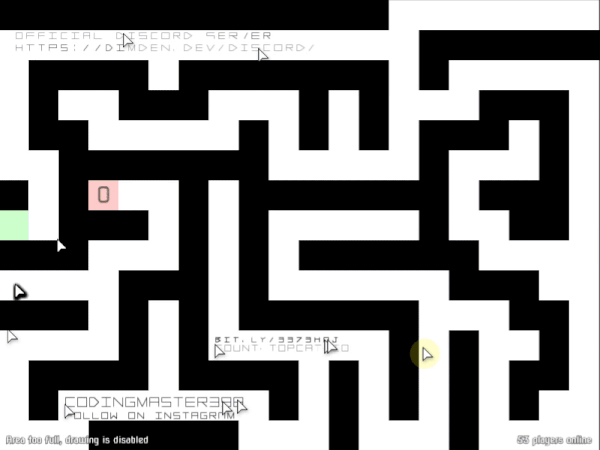

# Cursors.io Bot (The site is currently down 😔)

  

## Implemented
- Protocol 100%
- Pathfinder
- Text writter

## Apps
- Vanflux (default, write a "brand" in level 1)
- LevelUnlocker (unlock levels 1-14)

## How I use ???

- Install node.js (v14.16.0 +)
- Clone this repo
- Go to the directory that you cloned
- Install the dependencies using "npm install" command
- Run app with "npm run start" or "npm run dev"

### Level Unlocker App:

  

Gifs Created with [EzGif](https://ezgif.com/)
